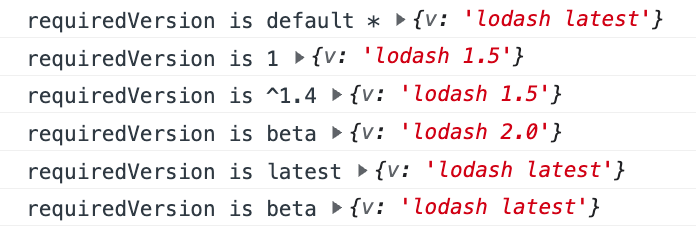

## **module-shared-pool优势**


1. 支持多版本共存。
2. 能够侵入到module-federaion的shared。
3. shareScopes抽象出了shareScope、pkgname、version、requiredVersion、singleton等选项来做到比较精细的控制依赖, 能满足引入一个模块所需的所有条件。
4. 演示

   一共只有两个API: setShared、getShared, 易于使用

   ```javascript
   import {setShared, getShared} from "module-shared-pool"
   
     setShared({
       name: "lodash",
       version: "1.0.0",
       async get() {
         return {
           v: "lodash 1.0"
         }
       }
     })
     setShared({
       name: "lodash",
       version: "1.5.2",
       async get() {
         return {
           v: "lodash 1.5"
         }
       }
     })
     setShared({
       name: "lodash",
       version: "2.0.0",
       async get() {
         return {
           v: "lodash 2.0"
         }
       }
     })
     setShared({
       name: "lodash",
       version: "latest",
       async get() {
         return {
           v: "lodash latest"
         }
       }
     })
     console.log("requiredVersion is default *", await getShared({name: "lodash"}))
     console.log("requiredVersion is 1", await getShared({name: "lodash", requiredVersion: "1"}))
     console.log("requiredVersion is ^1.4", await getShared({name: "lodash", requiredVersion: "^1.4"}))
     console.log("requiredVersion is beta", await getShared({name: "lodash", requiredVersion: "2"}))
     console.log("requiredVersion is latest", await getShared({name: "lodash", requiredVersion: "latest"}))
     console.log("requiredVersion is beta", await getShared({name: "lodash", requiredVersion: "beta"}))
   
   
   ```

   
   1.  


