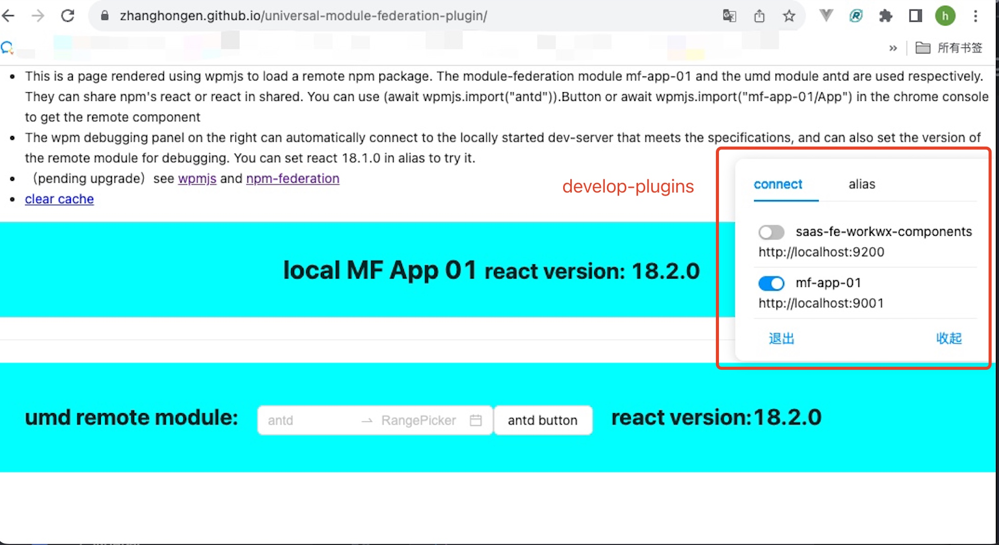

## wpmjs（web package manager）

wpmjs是一个能够加载umd、system、module-federation并共享依赖的加载器, 支持自定义或扩展模块加载器、支持多版本共存, 还配套了调试插件和打包工具插件

> 默认使用[systemjs](npmjs.com/package/systemjs)和[module-federation-runtime](npmjs.com/package/module-federation-runtime)来加载各种模块, 也可以重新自行实现默认行为)

## online demo
[to experience](https://zhanghongen.github.io/universal-module-federation-plugin/), 下面的demo演示了使用 远程mf模块 + 远程umd模块 + 本地react模块
> ``` js
> import wpmjs from "wpmjs"
> import React from "react"
> 
> wpmjs.setConfig({ baseUrl: "https://cdn.jsdelivr.net/npm" })
> wpmjs.addImportMap({
>     // 统一域名
>     "antd": "antd@5.9.0/dist/antd.min.js",
>     "dayjs": "dayjs@1.11.1",
>     // 自定义url
>     "mf-app-01": "mfapp01@https://cdn.jsdelivr.net/npm/mf-app-01@1.0.5/dist/remoteEntry.js",
>     "react-dom": "https://cdn.jsdelivr.net/npm/react-dom@18.2.0/umd/react-dom.development.js"
> })
> // umd、system、mf都会优先寻找此处写入的依赖
> wpmjs.setShared({ name: "react", version: "18.2.0", get: () => React })
> 
> await wpmjs.import("mf-app-01")
> await wpmjs.import("antd")
> wpmjs.get("react")

### develop-plugins（调试插件）
develop-plugins是一个可扩展的调试面板（[开发调试插件](./doc/develop-plugin.md)）, 系统插件connect和alias可以提供一键切换本地dev-server和调试指定版本的能力。


### 构建工具
使用同步语法加载远程模块
``` js
// bootstrap.js
import React from "react" // react is remote module
```
``` js
// webpack.config.js
new NpmFederation({
  remotes: {
    "react-dom": "https://cdn.jsdelivr.net/npm/react-dom@18.2.0/umd/react-dom.development.js"
  },
  shared: {react: {}}
})
```
1. [npm-federation](https://github.com/zhangHongEn/universal-module-federation-plugin/tree/main/packages/npm-federation-webpack)
2. [wpm-plugin](../wpm-plugin)

### 扩展加载器
修改默认加载器或开发新加载器请看API: registerLoader() 部分

<!--* 基于npm和module-federation的版本化远程模块管理器

## 特性
* 多模块规范（集成了system、umd、module-federation等模块规范）
* 调试模式/热更新（集成了调试面板与热更新, 可以自动连接本地启动的dev-server）
* 版本化管理（可以使用私有或公共npm作为远程模块存储源, 也可以自定义url拼接规则自行存储远程模块）
* 远程锁（支持动态配置远程模块的版本）
* 性能优化（插件自动化优化多个远程模块及其chunk的加载链路, 避免多次加载的等待）-->


## API
### setConfig()
``` ts
wpmjs.setConfig({
  baseUrl: string; // 统一url
  defaultModuleType(name): string; // 加载未设置moduleType的模块时使用的模块类型
  defaultVersion(name: string): string; // 加载未设置packageVersion的模块时使用的版本
  defaultImportMap(name: string): Map; // 详看addImportMap
  defaultGlobal({name, version}): string; // 加载未设置global的模块时使用的key
})
```
全局配置
1. 注意, 这个demo并不是wpmjs的默认值
    ``` js
    wpmjs.setConfig({
      baseUrl: "https://cdn.jsdelivr.net/npm/",
      defaultModuleType() { return "system" },
      defaultVersion() { return "latest" },
      defaultImportMap(name) { return {packageName: name, packageQuery: "v=" + +new Date} },
      defaultGlobal({name}) {return name}
    })
    ```

### addImportMap()
``` ts
wpmjs.addImportMap({
  [key: string]: string | {
    url?: string; // 自定义url
    global?: string; // global的变量名
    moduleType?: string; // 模块类型
    packageName?: string; // 包名, 会用作统一url规则的拼接
    packageQuery?: string; // 查询参数, 会用作统一url规则的拼接 
    packageVersion?: string; // 包版本, 会用作统一url规则的拼接
    packageFilename?: string; // 包入口文件, 会用作同意url规则的拼接
    strictVersion?: boolean; // 获取到的共享模块与指定版本不符则会发起请求加载指定版本
    shareScope?: string; // 寻找依赖的空间
  }
})
```
配置模块映射, 多个属性可分多次配置, 每个属性以第一次注册为准, 多次注册不会产生覆盖。其中如果有不规则的远程模块链接可以设置url属性, 否则推荐通过packageName、packageVersion等属性统一管理远程模块的链接。
1. 字符串简写语法: 通过url映射umd和mf模块
    1. global@https?://开头的设置为mf
        ``` js
        wpmjs.addImportMap({
            // 等同于配置: {moduleType: "mf", global, url}
            "mf-app-01": "mfapp01@https://cdn.jsdelivr.net/npm/mf-app-01@1.0.5/dist/remoteEntry.js",
        })
        ```
    2. https?://开头的设置为system
        ``` js
        wpmjs.addImportMap({
            // 等同于配置: {moduleType: "system", url}
            "react-dom": "https://cdn.jsdelivr.net/npm/react-dom@18.2.0/umd/react-dom.development.js"
        })
        ```
2. 简写语法: 通过npm包名语法映射配置
    1. 含有remoteEntry.js设置为mf
        ``` js
        wpmjs.addImportMap({
            // 等同于配置: {moduleType: "mf", packageName: "mf-app-01", packageVersion: "1.0.5", packageFilename: "dist/remoteEntry.js"}
            "mf-app-01": "mf-app-01@1.0.5/dist/remoteEntry.js"
        })
        ```
    2. 无remoteEntry.js设置为system
        ``` js
        wpmjs.addImportMap({
            // 等同于配置: {moduleType: "system", packageName: "react-dom", packageFilename: "dist/umd/react-dom.development.js"}
            "react-dom": "react-dom/umd/react-dom.development.js",
        })
        ```
    3. 无filename不设置moduleType
        ``` js
        wpmjs.addImportMap({
             // 等同于配置: {packageName: "react", packageVersion: "18.2.0"}
            "react": "react@18.2.0"
        })
        ```
3. 对象语法: 可以分多次分别设置{moduleType, global, packageName, packageQuery, packageVersion, packageFilename, strictVersion, shareScope } 。 以第一次设置的属性为准
    1. 单独设置包版本
        ``` js
        wpmjs.addImportMap({ "react": {packageVersion: "18.2.0", moduleType: "system"}, "react-dom": { packageVersion: "18.2.0" } })
        // react-dom会使用18.2.0版本而不是17.0.2
        wpmjs.addImportMap({ "react": "react", "react-dom": "react-dom@17.0.2/umd/react-dom.development.js" })
        ```
### import()
``` ts
import(request: string): Promise<Module | any>
```
加载并获取远程模块, 会自动缓存不进行多次请求, request可以是一个模块名, 也可以是一个模块+入口路径名
1. 直接加载某个入口, 结果等同于2
``` js
const entry = await wpmjs.import("mf-app-01/App")
```
2. 只加载某个模块, 不加载具体的入口
``` js
const module = wpmjs.import("mf-app-01")
// 需要的时候再加载入口./App
const entry = await container.$getEntry("./App")
```
> 对应写法2, 入参是一个模块名不包含入口路径的时候, 会为返回值挂载$getEntry来抹平各种类型的模块获取入口的方式。wpmjs为每种模块提供了默认的入口解析行为, 但你也可以进行自定义。
> * umd或system模块: [wpmjs/src/extras/umdAndSystem.js](./src/extras/umdAndSystem.js) resolveEntry()
> ``` js
> umdModule.$getEntry("App") ====内部逻辑等于==== await umdModule["App"]()
> ```
> * module-federation模块: [wpmjs/src/extras/mf.js](./src/extras/mf.js)  resolveEntry()
> ``` js
> mfModule.$getEntry("App") ====内部逻辑等于==== (await mfModule.get("App"))()
> ```
> * json模块: [wpmjs/src/extras/json.js](./src/extras/json.js)  resolveEntry()
> ``` js
> jsonModule.$getEntry("App") ====内部逻辑等于==== jsonModule["App"]
> ```

### get()
``` ts
wpmjs.get(request: string): any
```
从缓存中获取某个模块的同步值, 模块加载完毕前会获取到undefined
``` js
wpmjs.import("react")
wpmjs.get("react") // undefined
await wpmjs.import("react")
wpmjs.get("react") // React
```
### setShared()
``` ts
wpmjs.setShared({
    // 模块名
    name: string,
    // 模版版本
    version: string,
    // 模块加载函数
    get: function(): Promise<any>;
    
    loaded?: boolean | number;
    shareScope?: string;
    fromType?: string;
    from?: string;
})
```
注册一个共享模块, 共享模块支持多版本共存, ***自动在umd、system、module-federation及其shared等各种模块之间进行共享和互通***
``` js
wpmjs.setShared({
  name: "react",
  version: "18.2.0",
  async get() {
    // 可以去请求远程资源
    return System.import("https://react.js")
    // 也可返回本地对象
    return {test: 1111}
  }
})
```
### getShared()
``` ts
wpmjs.getShared({
  name: string;
  strictVersion?: boolean;
  singleton?: boolean;
  shareScope?: string;
  requiredVersion?: string;
}): Promise<any>
```
加载共享模块
``` js
await wpmjs.getShared({name: "react"})
await wpmjs.getShared({name: "react", requiredVersion: "18.2.0", singleton: true})
```
### sleep()
等待一段时间之后再发起加载请求
1. 动态importMap
``` js
wpmjs.sleep(window.fetch("https://importMap.json").then(res => res.json())
  .then(importMap => {
    wpmjs.addImportMap({
      react: {packageVersion: "17.0.2"},
      ...importMap
    })
  })
await wpmjs.import("react") // 17.0.2
```

### constructor()
创建新的wpmjs实例
1. 多版本共存
``` js
const wpmjs = window.wpmjs
const wpmjs1 = new wpmjs.constructor({
  // 打印错误信息时会附带name
  name: "wpmjs1"
})
    
wpmjs.addImportMap({ packageName: "react", packageVersion: "18.2.0", strictVersion: true })
wpmjs1.addImportMap({ packageName: "react", packageVersion: "17.0.2", strictVersion: true })
    
wpmjs.import("react") // 18.2.0
wpmjs1.import("react") // 17.0.2
```

### System
使用[systemjs-intercept](npmjs.com/package/systemjs-intercept)拦截了加载过程的systemjs实例, 这个实例加载的模块及依赖会使用wpmjs来寻找
``` js
wpmjs.System.import("react-dom")
```

### registerLoader()
注册新的模块类型与其加载器, 例:
1. 创建一个css加载器
    ``` js
    wpmjs.registerLoader({
        moduleType: "css",
        resolveUrl({name, version, query, entry, filename, baseUrl}) {
            if (/https?:\/\/(localhost|(\d+\.){2})/.test(baseUrl)) {
              return `${baseUrl}/${filename}`
            }
            query = query ? "?" + query : ""
            filename = filename ? "/" + filename : ""
            version = version ? "@" + version : ""
            return `${baseUrl}/${name}${version}${filename}${query}`
        },
        resolveContainer(url, {requestObj, pkgConfig}) {
            var link = document.createElement("link")
            link.href = url
            document.head.appendChild(link)
            return link
        },
        resolveEntry(container, entry) {
            return null
        }
    })
    
    wpmjs.addImportMap({ testCss: { packageName: "antd@0.0.1/dist/index.css", moduleType: "css" } })
    wpmjs.import("testCss")
    ```
2. 自定义system模块的加载行为（如url规则、执行js的方式等）
    ``` js
    wpmjs.registerLoader({
        resolveUrl() {
            return url
        },
        async resolveContainer(url, {requestObj}) {
            eval(await (await fetch(url)).text())
            return window[requestObj.name]
        },
        resolveEntry(container, entry) {
            return container[entry]
        }
    })
    ```

### debug()
``` ts
wpmjs.debug({
    baseUrl: string; // develop-panel会需要用到一些远程npm包, 此处为它设置源
    plugins: Array<string> // wpm-develop-panel是一个调试面板, 可以嵌入一些调试工具, 此处可以配置工具名, 会自动去加载wpm-develop-${plugins[index]}对应的npm包
})
```
打开调试面板, 可以使用系统插件和自定义插件
``` js
window.wpmjsDebug.debug({
    baseUrl: "https://cdn.jsdelivr.net/npm",
    plugins: ["connect", "alias"]
})
```

## 贡献指南
1. 补充单测（wpmjs sdk）
4. vite插件、rspack插件（使用@module-federation/vite实现; 持续关注rspack最新mf动态）
5. demo（各种demo仓库的建设）
6. 文档（概念、教程、相关规范、性能优化原理与优势）
7. 可以给webpack官方贡献性能优化的代码（详见chunkMap部分。https://github.com/module-federation/universe/discussions/1170）
8. 浏览器插件（调试面板插件版本, 只需要读取ws, 设置localstorage）
9. qiankun注意事项: qiankun需要设置global加publicPath
10. 热更新指定方式
11. 插件开发方式, 插件自动引入api实现, debug 参数实现
12. wpm-develop-preview插件开发, 类似一个story book
13. wpm-develop-panel可以拖动, 缓存折叠展开状态

